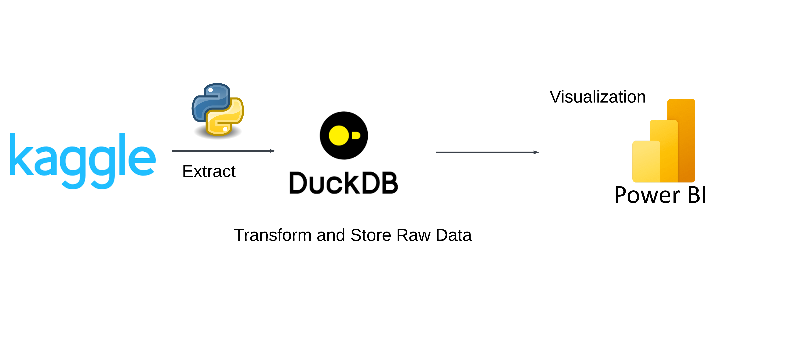
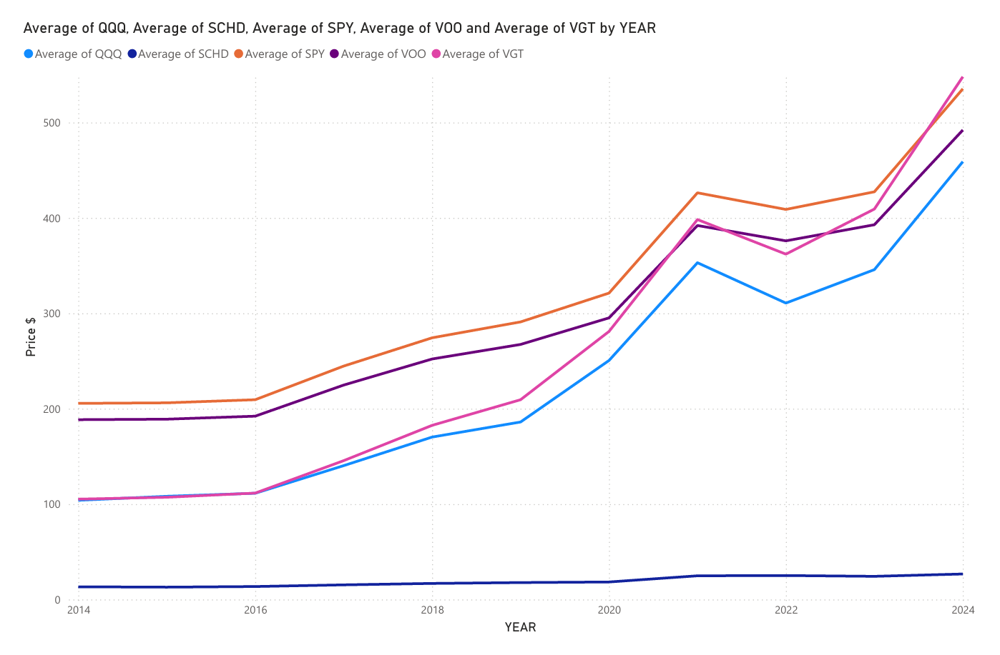
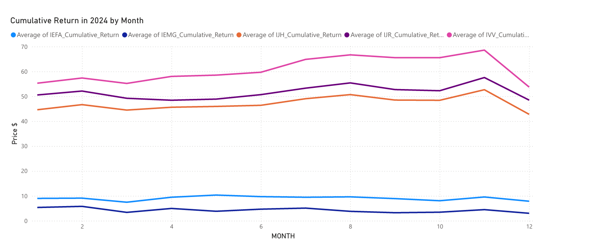

# epic-etf
ETF Performance Insights &amp; Comparison using DuckDB and Tableau

This project creates a pipeline for analyzing ETF (Exchange-Traded Fund) performance data. It pulls historical ETF price data from Kaggle, processes it using DuckDB, and visualizes the results in Power BI.

## [Data Sources](https://www.kaggle.com/datasets/unmoved/magnificent-7-past-10-years-prices-updated-daily?select=mag7.csv)

1. Bond ETFs (AGG, BIL, BND, EDV, IEF, SGOV, SHV, SHY, TLH, TLT, VGIT)
2. Equity ETFs (IEFA, IEMG, IJH, IJR, IVV, IWF, IWM, QQQ, RSP, SCHD, SPY, etc.)

## Data Pipeline
1. Data Import

Uses Kaggle API to fetch 10 years of historical ETF data
Downloads both bond and equity ETF datasets

2. Database Creation

Creates a DuckDB database (bonds.db)
Imports CSV data into database tables
Creates two main tables:

bonds: Raw bond ETF data
equity: Raw equity ETF data

3. Data Transformation
The SQL transformations calculate:

- Daily price changes
- Monthly and yearly aggregations
- Percentage changes
- Cumulative returns since inception

Creates two analysis tables:

bonds_analysis
equity_analysis

4. Data Export

Exports processed data to CSV files in the cleaned_data directory
Ready for import into Power BI

5. Visualization

Connect Power BI to the exported CSV files
Create interactive dashboards and reports

## Example Visualizations

## Future Improvements
1. Include Airflow for orchestration
2. Include Machine learning for predicting stock prices